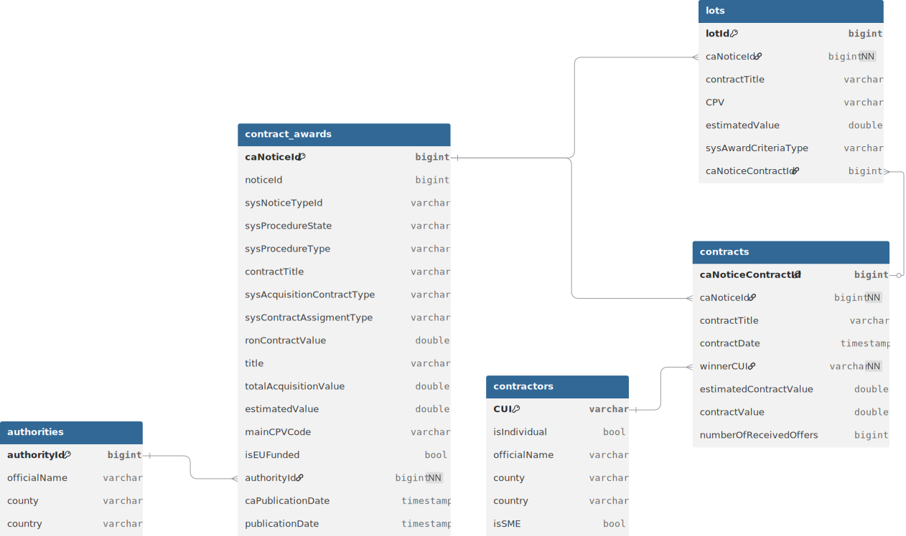

# SEAP data collection tool
Python tool for collecting contract data from the SEAP site.
## Usage
```
python main.py --help
usage: main.py [-h] YYYY-MM-DD YYYY-MM-DD batch_size

positional arguments:
  YYYY-MM-DD            Beginning date, format: YYYY-MM-DD
  YYYY-MM-DD            Ending date, format: YYYY-MM_DD
  batch_size            Batch size

options:
  -h, --help            show this help message and exit
```
Note that SEAP has a [limit for the number of API requests](https://e-licitatie.ro/pub/archive/news-feed/100002361) you can send. To avoid this, the program waits approximately 0.8 seconds between each request. This value can be changed in main.py... at your own risk :]
## Data format
The script saves the data in parquet files in batches. The approximate batch size can be chosen by the user using command line arguments. The batch size is there mainly for memory concerns and for saving incremental progress in case of a crash.
File structure:
```
SEAP_DATASET
├───authorities
├───contractors
├───contracts
├───contract_awards
└───lots
```
## Schema

## Variables
### Contract awards
| Name | Data Type | Description |
| :--- | :--- | :--- |
| **caNoticeId** | `int64` | Unique internal identifier |
| **noticeId** | `int64` | General identifier for the public notice |
| **sysNoticeTypeId** | `string` | The category of the notice |
| **sysProcedureState** | `string` | The current status of the procedure |
| **sysProcedureType** | `string` | The procurement method |
| **contractTitle** | `string` | The title given to the specific contract awarded |
| **sysAcquisitionContractType** | `string` | The nature of the contract |
| **sysContractAssigmentType** | `string` | The type of assignment |
| **ronContractValue** | `double` | The final value of the awarded contract |
| **title** | `string` | The title of the public notice |
| **totalAcquisitionValue** | `double` | The value of the entire acquisition process |
| **estimatedValue** | `double` | The initial estimated budget for the acquisition before bidding |
| **mainCPVCode** | `string` | CPV code |
| **isEUFunded** | `bool` | Whether the project is financed with EU funds |
| **authorityId** | `int64` | Foreign key referencing the unique ID of the Contracting Authority |
| **caPublicationDate** | `timestamp` | Date when the Contract Award Notice was officially published |
| **publicationDate** | `timestamp` | Date for when the Contract Award Notice was published on SEAP |
### Contracting Authorities
| Name | Data Type | Description |
| :--- | :--- | :--- |
| **authorityId** | `int64` | Unique internal identifier |
| **officialName** | `string` | The full name of the organization |
| **county** | `string` | The administrative county (Judet) where the Contracing Authority is located |
| **country** | `string` | The country of residence |
### Lots
| Name | Data Type | Description |
| :--- | :--- | :--- |
| **lotId** | `int64` | Unique internal identifier for the specific lot |
| **caNoticeId** | `int64` | Foreign key referencing the parent Contract Award Notice |
| **contractTitle** | `string` | The title assigned to this specific lot |
| **CPV** | `string` | CPV code |
| **estimatedValue** | `double` | The initial estimated budget for this lot before bidding |
| **sysAwardCriteriaType** | `string` | The evaluation method used |
| **caNoticeContractId** | `int64` | Foreign key referencing the specific awarded contract |
### Contracts
| Name | Data Type | Description |
| :--- | :--- | :--- |
| **caNoticeContractId** | `int64` | Unique internal identifier |
| **caNoticeId** | `int64` | Foreign key referencing the Contract Award Notice |
| **contractId** | `int64` | Id assigned to the contract|
| **contractTitle** | `string` | The official name or title of the specific contract lot. |
| **contractDate** | `timestamp` | The date when the contract awarded |
| **publicationDate** | `timestamp` | The date when the contract was registered|
| **winnerCUI** | `string` | CUI of the winner, or a placeholder for individuals; Foreign key for contractors |
| **estimatedContractValue** | `double` | The initial estimated value for this contract before bidding |
| **totalContractValue** | `double` | The final value for the contract |
| **currency** | `string` | The type of currency for estimatedContractValue and totalContractValue |
| **isFrameworkAgreement** | `bool` | Whether the contract is part from a framework agreement |
| **contractValue** | `double` | The total value agreed upon for the awarded contract |
| **numberOfReceivedOffers** | `int64` | The total number of bids received for this specific lot |
### Contractors
| Name | Data Type | Description |
| :--- | :--- | :--- |
| **CUI** | `string` | Fiscal identification number for the contractor or a placeholder for individuals |
| **isIndividual** | `bool` | Whether the contractor is an individual or a company |
| **officialName** | `string` | The name of the winning company or individual |
| **county** | `string` | The administrative county (Judet) where the contractor is located |
| **country** | `string` | The country where the contractor is located |
| **isSME** | `bool` | Whether the contractor is a small or medium enterprise |

### Contract_winners
| Name | Data Type | Description |
| :--- | :--- | :--- |
| **CUI** | `string` | Foreign key to contractors table |
| **caNoticeContractId** | `int64` | Foreign key to contracts table |

No personal information or contact info was collected.

## Notes
- There is also a field ```noticeAwardCriteriaList``` for each lot that the script doesn't save. It contains the weights of the reasons for choosing a bidder. For example:
    - Price: 60%
    - Warranty: 20%
    - Quality: 20%

  I chose not to include them because of the high variance in terminology that wouldn't be helpful for group-based analysis. Instead, I only went with ```sysAwardCriteriaType```, which has more standardized values.

- Contractors that show up as individuals don't have a CUI. For them, I used ```I_{noticeEntityAddressId}``` as a fallback primary key, and added an ```isIndividual``` column to the contractors table.

This is a tool for data collection. Users are responsible for following the Terms and Conditions of the SEAP/SICAP platform.